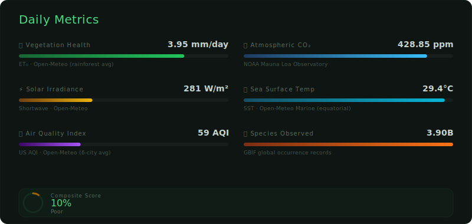

 

**[View Full Interactive Version (Vercel) &rarr;](https://grove-fractal.vercel.app/)**

This tree grows with each day, committing data daily to this repository. It acts as a public database of our collective efforts to combat climate change.

## 🌱 Help This Tree Grow
Contribute code to open source projects or donate to high-impact organizations.

### 💚 Water This Tree (Donate)
High-impact charities evaluated for cost-effectiveness.

- [**Giving Green Fund**](https://www.givinggreen.earth/top-climate-change-nonprofit-donations-recommendations)
- [**Clean Air Task Force**](https://www.catf.us/donate/)
- [**The Ocean Cleanup**](https://theoceancleanup.com/donate/)

### 🛠️ Build a Branch (Code)
Open source projects creating real-world impact.

- [**Electricity Maps**](https://github.com/electricitymaps/electricitymaps-contrib)
- [**Open Climate Fix**](https://github.com/openclimatefix)
- [**OpenSustain.tech**](https://github.com/protontypes/open-sustainable-technology)

### 📚 Deepen Your Roots (Learn)
- [**Effective Environmentalism**](https://www.effectiveenvironmentalism.org/climate-charities)
- [**Project Drawdown**](https://drawdown.org/solutions/table-of-solutions)
